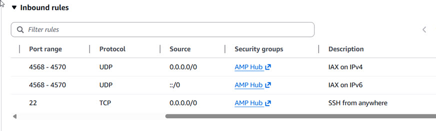

# Ampersand Hub Installation/User Instructions

These are the instructions for deploying the Ampersand Hub on AWS. These instructions
are based on a manual deployment. 

Send comments/questions to Bruce MacKinnon (KC1FSZ) using the e-mail address in [QRZ](https://www.qrz.com/db/KC1FSZ).

This is experimental work that explores the potential of ASL linking 
without the use of the Asterisk PBX system. [Project documentation is here](https://mackinnon.info/ampersand/). 

# Things You Need To Deploy

These instructions assume you are starting from nothing except:
* A server on which to run the hub with suitable network/firewall configuration.
* A user ID on the server that has sudo access.
* The URL of the binary package (listed below).
* The ASL node number and password for the hub node.

Latest packages: 
* [https://ampersand-asl.s3.us-west-1.amazonaws.com/releases/amp-hub-20260204-x86_64.tar.gz](https://ampersand-asl.s3.us-west-1.amazonaws.com/releases/amp-hub-20260204-x86_64.tar.gz)

# Steps to Upgrade

Most of the time the upgrade process only involves updating the `amp-hub`
binary. As such, a shorter process can be used. **This will not touch
your /usr/etc/amp-hub.env so the previous configuration should remain.** 

    export AMP_HUB_VERSION=20260204
    export AMP_ARCH=$(uname -m)
    wget https://ampersand-asl.s3.us-west-1.amazonaws.com/releases/amp-hub-${AMP_HUB_VERSION}-${AMP_ARCH}.tar.gz
    tar xvf amp-hub-${AMP_HUB_VERSION}-${AMP_ARCH}.tar.gz
    cd amp-hub-${AMP_HUB_VERSION}-${AMP_ARCH}
    # Run this script to perform the upgrade, or just read it and replicate
    # the steps (not too complicated)
    ./upgrade.sh

# Steps To Install (AWS Pre-Install)

NOTE: These steps will be different for other cloud providers.

Network setup:
* Create a Security Groups that allows IAX/SSH inbound.
* If desired, create an Elastic IP so that the public IPv4 address stays fixed.

Here's what the firewall rules look like:

IAM Setup:
* Create an IAM role for EC2 that grants `AdministratorAccess`. This may be useful
later when you want to run AWS CLI commands.

Create an EC2 instance:
* Debian 13, x86-64 using t3.micro instance type.
* If you don't already have a keypair, create one called "amp-hub-key"
* If necessary, download the private half of the keypair to ~/.ssh/amp-hub-key.pem so that you can log in using SSH.
* Accept the default EBS size of 8G.
* Associate the IAM role that grants administrator access.
* Associate the Elastic IP with the instance.
* Start and wait for the instance to come up.

If not created previously, get the public IPv4 address from the EC2 console. Use SSH to log into the new instance as admin:

    ssh -i ~/.ssh/amp-hub-key.pem admin@xxx.xxx.xxx.xxx

Or update your ~/.ssh/config file to register the new server and credentials:

    Host amp-hub
        Hostname amp-hub
        User admin
        IdentityFile C:\\Users\\bruce\\.ssh\\amp-hub-key.pem
        IdentitiesOnly yes

(The rest of the steps are executed on the new EC2 instance,
all from the admin home directory.)

# Steps To Install

Once you have a running Debian server these are the steps to install the 
software. 

Add the required Linux packages:

    sudo apt update
    sudo apt -y upgrade
    sudo apt -y install net-tools wget libcurl4-gnutls-dev

Install the binary package:

    export AMP_HUB_VERSION=20260204
    export AMP_ARCH=$(uname -m)
    wget https://ampersand-asl.s3.us-west-1.amazonaws.com/releases/amp-hub-${AMP_HUB_VERSION}-${AMP_ARCH}.tar.gz
    tar xvf amp-hub-${AMP_HUB_VERSION}-${AMP_ARCH}.tar.gz
    cd amp-hub-${AMP_HUB_VERSION}-${AMP_ARCH}
    # Run this script to perform the install, or just read it and replicate
    # the steps (not too complicated)
    ./install.sh

The package links are here if you need them:

* [https://ampersand-asl.s3.us-west-1.amazonaws.com/releases/amp-hub-20260130-x86_64.tar.gz](https://ampersand-asl.s3.us-west-1.amazonaws.com/releases/amp-hub-20260130-x86_64.tar.gz)

**Before starting the service** make a few adjustments /usr/etc/amp-hub.env file. This
file contains the settings of the environment variables that the server needs to operate.
These lines will probably need to change:

    # ===========================================================
    # Configure these settings before starting your node.
    AMP_NODE0_NUMBER=999999
    AMP_NODE0_PASSWORD=xxx
    # NOTE: Spaces are needed to get the numeric read-back to sound right.
    AMP_NODE0_GREETING="Welcome to node 9 9 9 9 9 9."
    AMP_IAX_PORT=4569
    # A comma-separated list of nodes that are allowed to connect, if 
    # restrictions are desired:
    AMP_IAX_ALLOWLIST=672731,581610,581611,581612,581613
    # ===========================================================

Start the Linux service:

    sudo systemctl start amp-hub

Check the log file for errors:

    journalctl -u amp-hub -f

# DTMF Commands Supported

There are a limited number of DTMF commands supported at the moment:

| DTMF     | Function                        |
|----------|---------------------------------|
| *3nnnnn  | Calls a specific node           |
| *71      | Disconnects all outbound calls  |
| *70      | Reports all active calls        |

